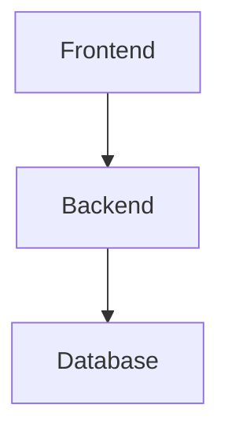

# System Architecture

## Overview

## Components
| Component       | Description                          |
|-----------------|--------------------------------------|
| Streamlit UI    | User interface with input forms      |
| Prediction Model| Trained sklearn linear regression    |