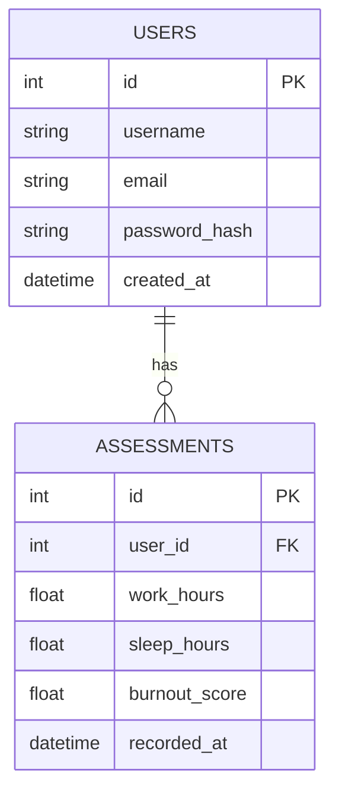

```mermaid
erDiagram
    USERS ||--o{ ASSESSMENTS : has
    USERS {
        int id PK
        string username
        string email
        string password_hash
        datetime created_at
    }
    ASSESSMENTS {
        int id PK
        int user_id FK
        float work_hours
        float sleep_hours
        float burnout_score
        datetime recorded_at
    }
```
